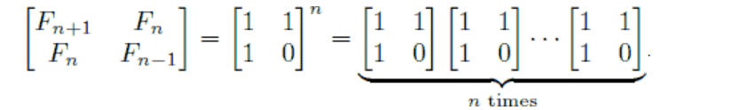

## 快速幂运算的解释

问n是否满足$x^n \mod n = x (1 < x < n)$？

先由一个例子引入：

$3^{11} = 3 \times 9^5 = 3 \times 9 \times 81^2 = 3 \times 9 \times 6561^1$

$result = 3 \times 9 \times 6561 = 3^{2^0} \times 3^{2^1} \times 3^{2^3}$

可见发现这次运算中，幂的结果等于变化中所有当**指数为奇数时底数之积**。其中，每次运算均发生指数除二（对应二进制右移一位），且当该指数为奇数时，原式乘上底数。

而这个过程其实相当于一个数进行模2取余求二进制数的过程，每次都除2，当模2余1，即对应二进制最末位为1时乘上底数，则由此可以推知快速幂运算的算法过程。

这个结论是可以证明的，如下：

对于任何十进制正整数n，设其对应二进制数为"$b_m...b_3b_2b_1$"，则有：
- 二进制转十进制：$n = 1b_1+2b_2+4b_3+...+2^{m-1}b_m$；
- 幂的二进制展开：$x^n = x^{1b_1}x^{2b_2}x^{4b_3}...x^{2^{m-1}b_m}$。

则对于$x^n$的求解，可以转化为：

- 计算$x^1,x^2,x^4...x^{m-1}$的值，相当于$x=x^2$的过程；
- 获取二进制各位$b_1,b_2,b_3,...,b_m$的值，相当于模2求余的过程。

上述过程中，当$b_i=0$时，$x^{2^{i-1}b_i}=1$，反之为$x^{2^{i-1}}$，由此可以顺利计算$x^n$。


相应代码：

```cpp
typedef long long ll;
ll mod_pow(ll x, ll n, ll mod) {
	ll res = 1;
	while(n > 0) {
		if(n & 1 == 1) res = res * x % mod; // 一个数&1的结果就是取该数二进制的最末位
		x = x * x % mod;
		n >>= 1;
	}	
	return res;
}
```

注意，运用位运算可以提高效率！

## 一道易错题

剑指 Offer 16. 数值的整数次方

实现 pow(x, n) ，即计算x的n次幂函数。不得使用库函数，同时不需要考虑大数问题。

其实就是快速幂运算的简单应用，然而却很容易忽略一些细节：

可以看几个判例：

```
1.00000
-2147483648
```

不特判的话有可能超时，注意当$x=1，x=-1，x=0，n=0$时都可以直接得到答案。

同时，如果执行`n=-n`，将会出错，因为2147483648超出了int的范围[-2147483648, 2147483647]！可以通过`long n1 = n`解决这个问题。

```
2.10000
3
```
应该注意到x可以为小数。

代码实现：

```cpp
class Solution {
public:
    double myPow(double x, int n) {
		if (x == 0) return 0;
        if (x == 1 || n == 0) return 1;
        if (x == -1) return n % 2 ? -1 : 1;
        long n1 = n; double ans = 1.0;
        if (n < 0) {
            x = 1 / x;
            n1 = -n1;
        }
        while (n1) {
            if (n1 & 1) ans *= x;
            x = x * x;
            n1 >>= 1;
        }
        return ans;
    }
};
```

## 矩阵快速幂介绍

题目描述

给定 n×n 的矩阵 A，求 A^k。

输入格式

第一行两个整数 n,k 接下来 n 行，每行 n 个整数，第 i 行的第 j 个数表示 Aij。

输出格式

输出 A^k

共 n 行，每行 n 个数，第 i 行第 j 个数表示 Aij, 每个元素对 10^9+7 取模。

1 <= n <= 100 

0 <= k <= 10 ^ 12

|Aij| <= 1000

分析：

本质上就是快速幂运算，只是底数变成了一个矩阵。

```cpp
Matrix Pow_Mod(Matrix m){//矩阵快速幂 
	Matrix M;
	for(int i = 1; i <= n; i++)
		for(int j = 1; j <= n; j++){
			if(i == j) M.mat[i][j] = 1;
			else M.mat[i][j] = 0;
		}// 结果矩阵, 初始状态是一个单位阵
	while(p){
		if(p & 1)	M = Mul(M, m); // 如果指数是奇数则乘上底数矩阵 
		m = Mul(m, m); // 底数矩阵平方
		p >>= 1; // 指数除二
	}
	return M;
}
```

其中的Mul函数返回两个矩阵相乘的结果：

```cpp
Matrix Mul(Matrix m1, Matrix m2){//方阵乘法&取模运算 
	Matrix M; 
	for(int i = 1; i <= n; i++)
		for(int j = 1; j <= n; j++)
			M.mat[i][j] = 0; 
	for(int i = 1; i <= n; i++)
		for(int j = 1; j <= n; j++){
			for(int k = 1; k <= n; k++){
				// 相加减取模的运算规律
				M.mat[i][j] += ( (m1.mat[i][k] % e) * (m2.mat[k][j] % e) );
				M.mat[i][j] %= e;
			}
		}
	return M;
}
```

## 矩阵快速幂的应用

### 斐波那契

题目描述：

f(x) = 1 .... (x=1,2)

f(x) = f(x-1) + f(x-2) .... (x>2)

对于给定的整数 n 和 m，我们希望求出：f(1) + f(2) + ... + f(n) 的值。

但这个数字很大，所以需要再对 p 求模。

为什么要通过矩阵快速幂来运算斐波那契问题呢，这是因为斐波那契运算的每一项可以用矩阵幂的运算得到，而幂运算又有快速幂运算来快速解决。

为什么可以用矩阵解决？请看下图：



可见斐波那契数列每项都可以由一个矩阵的若干次方得到，而我们又知道可以通过快速幂运算解决开方运算，所以自然可以用矩阵轻松解决！

这里的思想很巧妙：

**把一个问题转换为另一个问题，然后就可以通过新的问题特有的且优秀的方法来解决原来的问题**。

对于斐波那契数列还有一个重要性质，就是前 n 项和等于 **f(n+2)-1**，这个结论可以又递推法轻松得到。

代码实现：

```cpp
long long n, mod, sum = 0;
struct Matrix{
	long long mat[3][3];
};

Matrix Mul(Matrix m, Matrix m_f, int t) {//矩阵乘法 m*(m_f或m) 
	Matrix M;
	for(int i = 1; i <= 2; i++)
		for(int j = 1; j <= 2; j++)
			M.mat[i][j] = 0;
	for(int i = 1; i <= 2; i++)
		for(int j = 1; j <= t; j++)//t==1时得m_f, t==2时得m 
			for(int k = 1; k <= 2; k++) {
				M.mat[i][j] += (m.mat[i][k] % mod) * (m_f.mat[k][j] % mod);
				M.mat[i][j] %= mod;
			}
	return M;
}

long long Pow_Mod(long long num) {//矩阵快速幂 
	Matrix m, m_f;
	m.mat[1][1] = m.mat[1][2] = m.mat[2][1] = 1; m.mat[2][2] = 0;
	m_f.mat[1][1] = m_f.mat[2][1] = 1; 
    // 结果矩阵 初始化为 [F2; F1] 求n次 -> [Fn+2; Fn+1]
    // 只需计算2个，降低复杂度
	while(num) {
		if(num & 1)	m_f = Mul(m, m_f, 1);
		m = Mul(m, m, 2);
        num >>= 1;
	}
	return m_f.mat[1][1];
}

int main() {
	scanf("%lld%lld", &n, &mod);
	sum = Pow_Mod(n) - 1; // f(1)+...+f(n) = f(n+2)-1
	printf("%lld", sum % mod);
	return 0;
}
```
