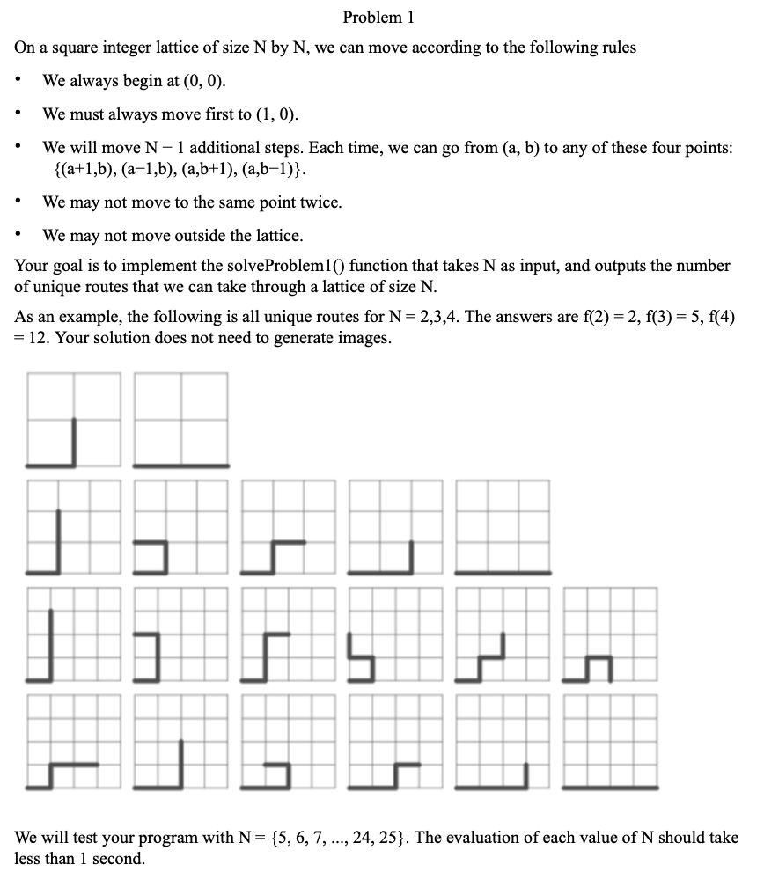

```py
#!/usr/bin/env python3
import time


def solve_problem1(n: int):
    vis = [[0] * (n + 1) for _ in range(n + 1)]
    dp = [[[-1] * (n + 1) for _ in range(n + 1)] for _ in range(n + 1)]
    vis[0][0] = vis[1][0] = 1
    return dfs(1, 0, n - 1, vis, n, dp)


def dfs(x, y, c, vis, n, dp):
    if c == 0:
        return 1
    if dp[x][y][c] != -1:
        return dp[x][y][c]

    t = 0
    dx, dy = [1, 0, 0, -1], [0, 1, -1, 0]
    for i in range(4):
        nx, ny = x + dx[i], y + dy[i]
        if 0 <= nx <= n and 0 <= ny <= n and vis[nx][ny] != 1:
            vis[nx][ny] = 1
            t += dfs(nx, ny, c - 1, vis, n, dp)
            vis[nx][ny] = 0

    dp[x][y][c] = t  # 缓存结果
    return t


if __name__ == "__main__":
    for i in range(21):
        s = time.time()
        ans = solve_problem1(i + 5)
        e = time.time()
        print(f"{i + 5}: {ans} - {e - s}s")
```